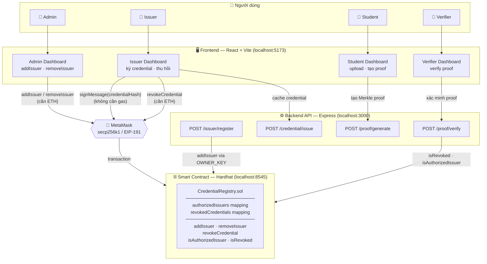
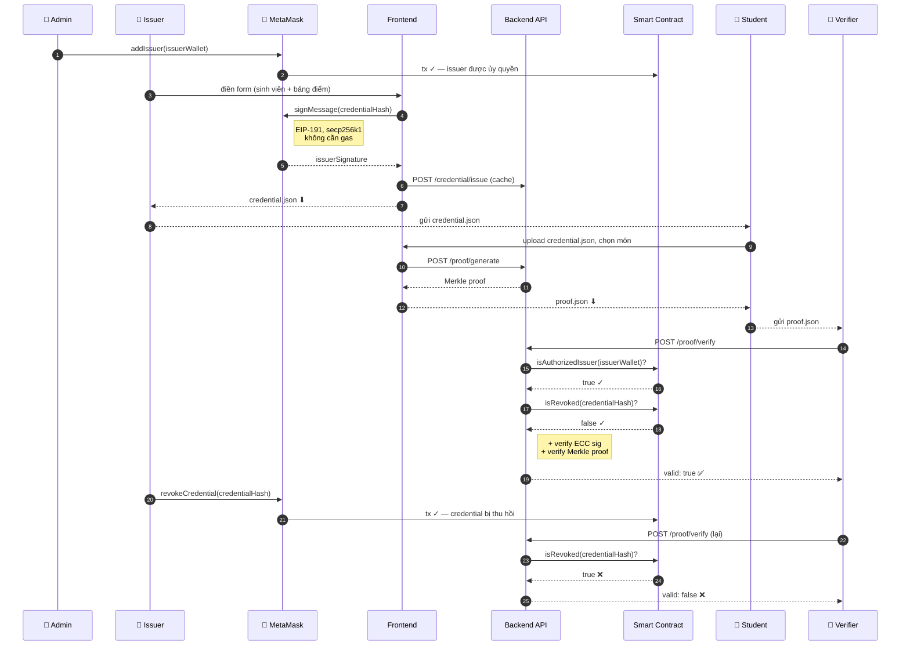

# CredProof
### Decentralized Academic Credential Verification
### IT4527E — Blockchain & Applications Capstone Project

Hệ thống cấp phát, xác minh và thu hồi bằng cấp học thuật số trên blockchain.  
Kết hợp **ECC Signature (MetaMask)** + **Merkle Selective Disclosure** + **On-chain Registry**.

---

## Yêu cầu cốt lõi

| Yêu cầu | Cách thực hiện |
|---------|----------------|
| ECC Signature | Issuer ký `credentialHash` bằng MetaMask (secp256k1 / EIP-191 personal sign). Verifier dùng `ethers.verifyMessage` để khôi phục địa chỉ issuer. |
| Merkle Selective Disclosure | Mỗi môn học là một leaf trong Merkle Tree. Sinh viên chỉ tiết lộ môn cần thiết — verifier xác minh proof mà không thấy toàn bộ bảng điểm. |
| On-chain Issuer Registry | `CredentialRegistry.sol` quản lý danh sách issuer được ủy quyền và credential bị thu hồi. |
| Revocation | Issuer thu hồi credential bằng giao dịch on-chain. Trạng thái kiểm tra được tức thì. |

---

## Workflow

| Bước | Vai trò | Hành động | Ghi chú |
|------|---------|-----------|---------|
| 1 | **Admin** | `addIssuer(wallet)` on-chain | MetaMask popup, cần ETH |
| 2 | **Issuer** | Ký `credentialHash` bằng MetaMask → download `credential.json` | 1 popup, **không cần gas** |
| 3 | **Student** | Upload credential → chọn môn → download `proof.json` | Off-chain hoàn toàn |
| 4 | **Verifier** | Upload proof → kiểm tra 4 lớp | ECC + Merkle + on-chain |
| 5 | **Issuer** | `revokeCredential(hash)` on-chain | MetaMask popup, cần ETH |

---

## Kiến trúc hệ thống

### Tổng quan components



### Luồng dữ liệu



### Cơ chế mã hoá (off-chain, không cần gas)

**ECC Signature — secp256k1 / EIP-191**

```
credentialHash  = keccak256( issuerWallet | studentWallet | studentId |
                             universityName | merkleRoot | issuedAt | ... )

issuerSignature = MetaMask.signMessage(credentialHash)   ← 1 popup, no gas

verify          = ethers.verifyMessage(credentialHash, issuerSignature)
                  → phải trả về đúng issuerWallet
```

**Merkle Tree — keccak256, sortPairs = true**

```
leaf  = keccak256("courseCode|grade")        ← mỗi môn học là 1 leaf

              [ merkleRoot ]
             /              \
        H(L0, L1)        H(L2, L2)
        /       \              \
      L0        L1             L2
  IT3010E|A  IT3030E|B     IT3100E|C

Selective Disclosure: proof của L0 = [L1, H(L2,L2)]
→ Verifier xác minh được L0 mà không biết L1, L2 là môn gì
```

### Cấu trúc file off-chain

| Trường | `credential.json` | `proof.json` |
|--------|:-----------------:|:------------:|
| `credentialHash` + `issuerSignature` | ✅ | ✅ |
| `merkleRoot` | ✅ | ✅ |
| `issuerWallet`, `studentWallet` | ✅ | ✅ |
| `courses` (toàn bộ bảng điểm) | ✅ | ❌ ẩn |
| `selectedCourses` + `merkleProof[]` | ❌ | ✅ |
| Lưu ở đâu | Sinh viên giữ | Gửi cho Verifier |

---

## Yêu cầu phần mềm

| Phần mềm | Phiên bản |
|----------|-----------|
| Node.js | v18+ (khuyến nghị v20+) |
| MetaMask | Extension Chrome/Firefox (bắt buộc) |
| Git | bất kỳ |

---

## Cài đặt

### 1. Clone & cài dependencies

```bash
git clone https://github.com/sonnopro123/Project-Blockchain-Group-11.git
cd Project-Blockchain-Group-11

# Dependencies gốc (Hardhat, backend)
npm install

# Dependencies frontend
cd frontend && npm install && cd ..
```

### 2. Tạo file .env

Tạo `.env` tại thư mục gốc:

```env
RPC_URL=http://127.0.0.1:8545
OWNER_PRIVATE_KEY=0xac0974bec39a17e36ba4a6b4d238ff944bacb478cbed5efcae784d7bf4f2ff80
CONTRACT_ADDRESS=
PORT=3000
```

> `CONTRACT_ADDRESS` để trống — deploy script sẽ tự điền (Bước 4).

---

## Chạy project (local Hardhat)

> ⚠️ **Chạy đúng thứ tự** — backend phải start **sau** khi deploy contract.  
> Nếu `CONTRACT_ADDRESS` còn trống trong `.env`, backend sẽ báo lỗi khi có request gọi blockchain.

Mở **4 terminal**, chạy theo thứ tự:

### Terminal 1 — Khởi động Hardhat node

```bash
npx hardhat node
```

Xác nhận thấy:
```
Account #0: 0xf39Fd6e51aad88F6F4ce6aB8827279cffFb92266 (10000 ETH)
Account #1: 0x70997970C51812dc3A010C7d01b50e0d17dc79C8 (10000 ETH)
```

### Terminal 2 — Deploy smart contract

```bash
npx hardhat run scripts/deploy.js --network localhost
```

Script tự động ghi `CONTRACT_ADDRESS` vào `.env` và `frontend/.env`.  
Xác nhận thấy dòng: `Contract deployed to: 0x5FbDB...`

### Terminal 3 — Khởi động backend *(sau khi deploy xong)*

```bash
node backend/server.js
# Server running on port 3000
# [blockchain] Contract ready at 0x5FbDB...
```

> Nếu thấy `[blockchain] CONTRACT_ADDRESS is empty` thay vì `Contract ready` → chưa deploy hoặc `.env` chưa có địa chỉ. Dừng lại, chạy lại Terminal 2 trước.

### Terminal 4 — Khởi động frontend

```bash
cd frontend && npm run dev
# http://localhost:5173
```

---

## Cấu hình MetaMask

### Thêm mạng Hardhat Localhost

MetaMask → click tên mạng → "Add a custom network":

| Trường | Giá trị |
|--------|---------|
| Network name | Hardhat Localhost |
| RPC URL | http://127.0.0.1:8545 |
| Chain ID | 31337 |
| Symbol | ETH |

### Import tài khoản Hardhat

MetaMask → click avatar → "Import account" → dùng private key:

| Account | Địa chỉ | Private Key | Vai trò |
|---------|---------|-------------|---------|
| #0 | 0xf39Fd6e51aad88F6F4ce6aB8827279cffFb92266 | `0xac0974bec39a17e36ba4a6b4d238ff944bacb478cbed5efcae784d7bf4f2ff80` | Admin / Owner |
| #1 | 0x70997970C51812dc3A010C7d01b50e0d17dc79C8 | `0x59c6995e998f97a5a0044966f0945389dc9e86dae88c7a8412f4603b6b78690d` | Issuer mặc định |

> Đây là **Hardhat public defaults** — chỉ dùng cho local testing, không có ETH thật.

### Reset MetaMask sau mỗi lần restart Hardhat node

Mỗi account đã dùng → Settings → Advanced → **"Clear activity and nonce data"**

---

## Demo Flow

### Bước 1 — Admin thêm Issuer

1. Vào `/admin` → kết nối **Account #0** (Owner)
2. Tab "Quản lý Issuer" → nhập địa chỉ Account #1 → "Thêm"
3. MetaMask popup → Confirm giao dịch

### Bước 2 — Issuer phát hành văn bằng

1. Vào `/issuer` → kết nối **Account #1** (Issuer)
2. Tab "Phát hành văn bằng" → điền thông tin sinh viên + bảng điểm
3. "Ký & Tạo Credential JSON" → MetaMask popup → Confirm
4. Tải file `credential.json` — giao cho sinh viên

### Bước 3 — Sinh viên xác nhận & tạo proof

1. Vào `/student` → kết nối ví sinh viên (địa chỉ khớp với `studentWallet` trong credential)
2. Upload `credential.json` → "Xác nhận văn bằng" → phải pass tất cả 7 checks
3. Tab "Tạo Proof" → chọn môn muốn tiết lộ → "Tạo Merkle Proof"
4. Tải file `proof.json` — gửi cho Verifier

### Bước 4 — Verifier xác minh proof

1. Vào `/verifier` → Upload `proof.json`
2. "Xác minh" → kiểm tra on-chain + ECC + Merkle → hiện kết quả chi tiết

### Bước 5 — Thu hồi credential

1. Vào `/issuer` → kết nối **Account #1**
2. Tab "Thu hồi văn bằng" → `credentialHash` tự điền từ lần phát hành trước
3. "Thu hồi văn bằng on-chain" → Confirm

### Bước 6 — Verify lại sau thu hồi

Verifier upload lại `proof.json` cũ → check "Credential chưa bị thu hồi" → **Fail** ✗

---

## Cấu trúc thư mục

```
Capstone-Project-Blockchain-Group-11/
│
├── contracts/
│   └── CredentialRegistry.sol       # Smart contract: addIssuer, removeIssuer, revokeCredential
│
├── backend/
│   ├── server.js                    # Express entry point (port 3000)
│   ├── routes/
│   │   ├── issuer.js                # POST /issuer/register
│   │   ├── credential.js            # POST /credential/issue|revoke, GET /credential/:id
│   │   └── proof.js                 # POST /proof/generate|verify
│   ├── services/
│   │   └── eccService.js            # ECC sign/verify (secp256k1)
│   ├── merkle/
│   │   └── merkleService.js         # Merkle tree, proof generation/verification
│   ├── blockchain/
│   │   └── blockchainService.js     # ethers.js, kết nối contract
│   └── storage/
│       ├── db.js                    # JSON file storage helper
│       └── data.json                # Dữ liệu off-chain (không commit)
│
├── frontend/
│   ├── src/
│   │   ├── pages/
│   │   │   ├── Landing.jsx
│   │   │   ├── AdminDashboard.jsx   # Quản lý issuer on-chain
│   │   │   ├── IssuerDashboard.jsx  # Phát hành & thu hồi credential
│   │   │   ├── StudentDashboard.jsx # Upload, xác nhận, tạo proof
│   │   │   └── VerifierDashboard.jsx
│   │   ├── components/              # Button, Card, Badge, Input, Navbar, Toast, ...
│   │   ├── layouts/                 # DashboardLayout (wrong-chain banner)
│   │   ├── contexts/
│   │   │   └── WalletContext.jsx    # Global MetaMask state (persist qua navigation)
│   │   ├── services/
│   │   │   ├── wallet.js            # connectWallet, getReadProvider
│   │   │   ├── contract.js          # addIssuer, revokeCredential, getAuthorizedIssuers
│   │   │   ├── credential.js        # computeHash, signCredential, validateOffChain
│   │   │   ├── merkle.js            # buildTree, generateRoot, generateProof
│   │   │   └── api.js               # Axios wrapper → backend port 3000
│   │   └── config/
│   │       ├── abi.js               # Contract ABI
│   │       └── branding.js          # APP_NAME, APP_TAGLINE
│   ├── .env                         # VITE_CONTRACT_ADDRESS, VITE_RPC_URL, VITE_API_BASE_URL
│   └── package.json
│
├── scripts/
│   └── deploy.js                    # Deploy + tự ghi CONTRACT_ADDRESS vào .env files
│
├── test/
│   ├── CredentialRegistry.test.js
│   ├── eccMerkle.test.js
│   └── e2e.test.js
│
├── .env                             # Root env (không commit)
├── .env.example
├── hardhat.config.js
└── readme.md
```

---

## Biến môi trường

### `.env` (thư mục gốc — backend + Hardhat)

```env
RPC_URL=http://127.0.0.1:8545
OWNER_PRIVATE_KEY=0xac0974bec39a17e36ba4a6b4d238ff944bacb478cbed5efcae784d7bf4f2ff80
CONTRACT_ADDRESS=                    # Tự điền sau deploy
PORT=3000
```

### `frontend/.env`

```env
VITE_CONTRACT_ADDRESS=               # Tự điền sau deploy
VITE_RPC_URL=http://127.0.0.1:8545
VITE_API_BASE_URL=http://localhost:3000
```

---

## Chạy test

```bash
# Smart contract unit test
npx hardhat test

# ECC + Merkle unit test
node test/eccMerkle.test.js

# End-to-end (yêu cầu Hardhat node + backend đang chạy)
node test/e2e.test.js
```

---

## Lưu ý quan trọng

- Mỗi lần **restart Hardhat node** → contract reset → phải deploy lại và reset MetaMask activity
- Deploy script tự động cập nhật `CONTRACT_ADDRESS` vào cả hai file `.env`
- File `.env` không được commit lên Git
- Nút "Chuyển mạng ngay" trong banner đỏ giúp tự động switch MetaMask sang Chain 31337
- Issuer phải dùng **đúng ví đã được Admin ủy quyền** để phát hành — dùng sai ví sẽ bị reject

